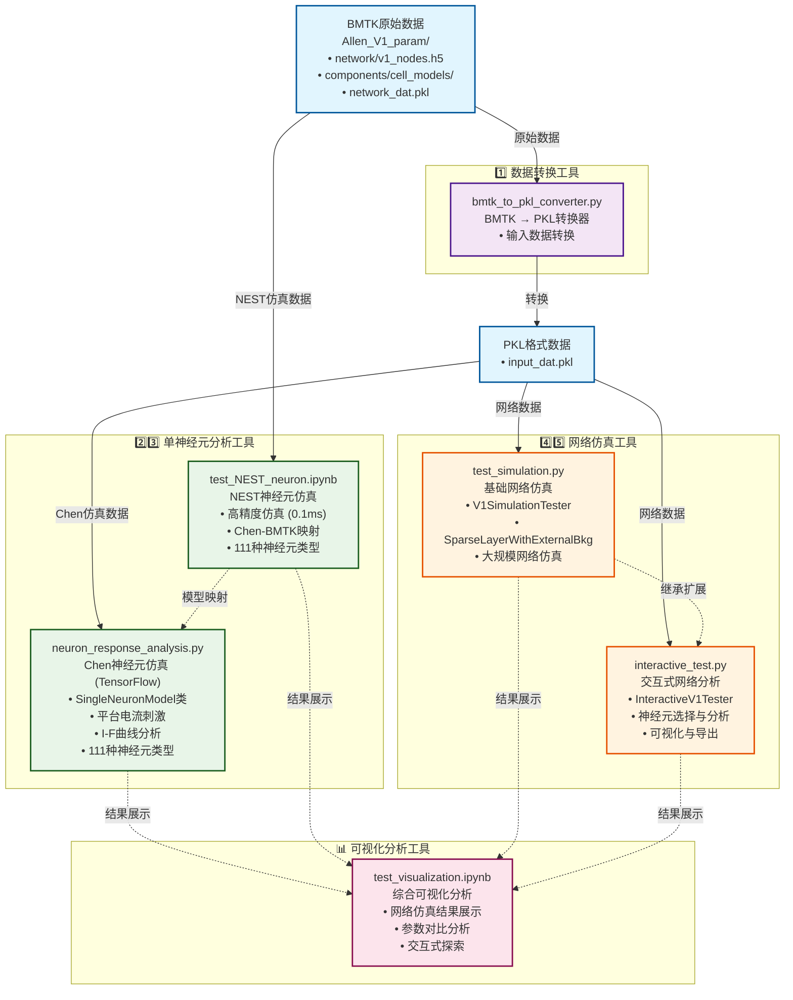

# Chen Package Test - V1模型仿真测试工具包

## 概述

Chen Package Test是一个专门用于测试和验证[Training-data-driven-V1-model-test](https://github.com/ifgovh/Training-data-driven-V1-model-test)工具包的仿真测试框架。该工具包基于Allen研究所的小鼠V1（初级视觉皮层）模型，实现了GLIF3（广义漏积分发放）神经元模型的大规模网络仿真。

**核心特性**：
- 支持大规模V1网络仿真和单神经元电生理特性分析
- 提供两种仿真引擎：TensorFlow（网络仿真）和NEST（高精度单神经元分析）
- 兼容111种不同的神经元类型，覆盖全部皮层层级和细胞类型
- 包含完整的数据转换、可视化和分析工具链

## 🏗️ 架构总览

下图展示了Chen Package Test工具包的整体架构、各模块功能和数据流向：



### 📋 架构说明

该架构图展示了工具包的四个主要功能分区：

- **数据转换工具**: 将BMTK格式转换为工具包兼容的PKL格式
- **单神经元分析工具**: 提供Chen（TensorFlow）和NEST两种仿真引擎
- **网络仿真工具**: 支持基础和交互式的大规模网络仿真
- **可视化分析工具**: 综合展示和分析仿真结果

## 📁 数据准备

确保您有以下格式的数据文件：

```
Training-data-driven-V1-model-test
├── Chen工具包的所有内容
    Chen_package_test (我们的测试工具包放在Chen工具包文件夹下)
    ├── Allen_V1_param/                  # BMTK数据目录
        ├── network/                     # 网络结构文件
        ├── components/                  # 模型参数文件
        └── inputs/                      # 输入数据文件
    ├── bmtk_to_pkl_converter.py     # 数据转换模块
    ├── neuron_response_analysis.py  # Chen神经元响应分析模块
    ├── test_NEST_neuron.ipynb       # NEST神经元仿真测试notebook
    ├── test_simulation.py           # 网络仿真测试脚本
    ├── interactive_test.py          # 交互式网络测试工具
    ├── test_visualization.ipynb     # Jupyter可视化notebook
    └── README.md              
```

---

## 🔧 核心模块详解

### 1️⃣ bmtk_to_pkl_converter.py - 数据转换模块

#### 功能概述

  将BMTK（Brain Modeling Toolkit）格式的网络数据转换为工具包兼容的PKL格式。该模块是整个工具链的起点，负责将原始数据转换为后续分析和仿真所需的标准格式。

#### 核心函数

  ##### `convert_input_data(bmtk_dir, output_dir)`
    - **功能**: 转换输入数据（LGN和背景输入）
    - **处理步骤**:
        1. 读取LGN节点信息和脉冲数据
        2. 读取背景节点信息和脉冲数据
        3. 构建连接权重矩阵
        4. 保存为input_dat.pkl格式

  **输入数据结构**:
    - **LGN输入**: 模拟视觉刺激信号，通常包含方向选择性和时间动态
    - **背景输入**: 模拟大脑其他区域的输入，通常为泊松分布的随机脉冲

---

## 单神经元分析工具

### 2️⃣ neuron_response_analysis.py - 神经元响应分析模块

#### 功能概述

  专门用于分析单个神经元在不同平台电流刺激下的膜电位和脉冲响应特性。该模块提供了完整的神经元电生理特性分析工具，支持111种不同的神经元类型，能够生成详细的响应图表和I-F（电流-发放频率）曲线。

#### 核心功能

  <details>
  <summary><strong>📋 查看所有功能详情</strong></summary>

  ##### `SingleNeuronModel`类
    - **功能**: 基于BillehColumn动力学的单神经元模型，完全保持相同的动力学机制
    - **核心参数**:
        - `neuron_model_template_index`: 目标神经元类型索引（支持111种类型）
        - `model_path`: 模型文件路径（默认：'../GLIF_network/network_dat.pkl'）
        - `dt`: 时间步长（ms，默认1.0ms）
        - `gauss_std`: 高斯伪导数标准差（默认0.5）
        - `dampening_factor`: 阻尼因子（默认0.3）
    - **技术特点**:
        - **完全兼容**: 与BillehColumn使用相同的参数处理和动力学方程
        - **电压归一化**: 应用与BillehColumn完全一致的电压缩放处理
        - **状态管理**: 维护神经元的所有动力学状态（膜电位、不应期、自适应电流等）

  ##### `SingleNeuronModel.simulate(T, platform_current, current_start, current_end)`
    - **功能**: 模拟单个神经元在平台电流刺激下的完整响应过程
    - **核心参数**:
        - `T`: 总仿真时间（ms）
        - `platform_current`: 平台电流强度（pA）
        - `current_start/end`: 电流刺激的起止时间
    - **返回数据**:
        - `time`: 时间序列数组
        - `current_sequence`: 输入电流时间序列
        - `voltages`: 膜电位轨迹
        - `spikes`: 脉冲发放序列（二进制）

  ##### `plot_single_response(time, current, voltage, spikes, neuron_type, current_amplitude)`
    - **功能**: 绘制单个神经元的详细响应图
    - **图形结构**:
        - **上子图**: 输入电流波形，清晰显示平台电流的时间特性
        - **下子图**: 膜电位轨迹与脉冲标记的叠加显示
    - **可视化特性**:
        - **脉冲标记**: 在脉冲发生时刻的膜电位位置添加红色竖线标记
        - **统计信息**: 自动计算并显示脉冲总数和平均发放频率
        - **中文支持**: 完整的中文标签和图例支持
    - **输出信息**:
        - 脉冲计数统计
        - 发放频率计算（Hz）
        - 响应延迟分析

  ##### `analyze_current_response(neuron_type, neuron, T, current_amplitudes, current_start, current_end)`
    - **功能**: 系统分析神经元在多个电流强度下的响应特性
    - **分析流程**:
        1. **多电流仿真**: 对每个电流强度独立进行完整仿真
        2. **响应对比**: 生成多子图布局显示所有条件下的响应
        3. **统计分析**: 计算每个条件下的发放特性
        4. **I-F曲线**: 自动生成电流-发放频率关系曲线
    - **图形布局**:
        - **第1行**: 所有电流强度的波形叠加显示
        - **后续行**: 每个电流强度对应的膜电位响应
    - **优化特性**:
        - **紧凑布局**: 通过`hspace=0.3`和`pad=0.5`优化子图间距
        - **颜色编码**: 使用viridis色彩映射区分不同电流强度
        - **信息标注**: 每个子图包含电流值、脉冲数和发放频率

  ##### `plot_if_curve(neuron_type, results, save_dir=None)`
    - **功能**: 绘制电流-发放频率（I-F）特性曲线
    - **科学意义**: I-F曲线是神经元最重要的输入-输出特性之一
    - **图形特性**:
        - **数据点标注**: 每个数据点显示精确的发放频率值
        - **趋势分析**: 清晰显示神经元的兴奋性阈值和饱和特性
        - **生物学解释**: 反映神经元的内在兴奋性和适应特性
    - **保存功能**: 支持将I-F曲线保存为PNG格式

  </details>

#### 技术实现

  ##### 动力学兼容性
    - **参数处理**: 与BillehColumn使用完全相同的参数加载和预处理流程
    - **电压归一化**: 应用相同的电压缩放和偏移处理
    - **动力学方程**: 使用相同的GLIF3动力学方程和状态更新规则

  ##### 仿真精度控制
    - **时间步长**: 默认1ms时间步长，确保膜电位动力学的精确积分
    - **电流控制**: 精确控制平台电流的起止时间和幅度
    - **状态管理**: 正确初始化和维护神经元的所有动力学状态

### 3️⃣ test_NEST_neuron.ipynb - NEST神经元仿真测试

#### 功能概述

  基于NEST仿真器实现的神经元响应分析工具，与`neuron_response_analysis.py`中的Chen神经元仿真相对应。该Jupyter notebook提供了使用NEST仿真器进行单神经元电生理特性分析的完整工具链，支持111种不同的神经元类型，是对Chen神经元仿真的NEST版本实现。

#### 核心功能

  <details>
  <summary><strong>📋 查看NEST仿真功能详情</strong></summary>

  ##### `chen_to_bmtk_mapping_dict(chen_network_path, bmtk_nodes_path)`
    - **功能**: 建立Chen 111个神经元模板与BMTK 111个神经元模板之间的对应关系
    - **输入参数**:
        - `chen_network_path`: Chen网络数据文件路径（默认：'Allen_V1_param/network_dat.pkl'）
        - `bmtk_nodes_path`: BMTK节点数据文件路径（默认：'Allen_V1_param/network/v1_nodes.h5'）
    - **返回值**: 包含Chen索引到BMTK node_type_id映射的字典
    - **技术特点**:
        - 通过Chen网络中的神经元ID列表查找对应的BMTK节点类型
        - 严格验证一对一映射关系，确保数据完整性
        - 支持111种不同的神经元类型映射

  ##### `simulate_neuron_response(node_type_id, platform_current, T, dt, current_start, current_end)`
    - **功能**: 使用NEST仿真器模拟单个神经元的平台电流响应
    - **核心参数**:
        - `node_type_id`: BMTK节点类型ID
        - `platform_current`: 平台电流强度（单位：pA）
        - `T`: 仿真时间（ms，默认1000ms）
        - `dt`: 时间步长（ms，默认0.1ms）
        - `current_start/end`: 电流刺激的起止时间（默认200-800ms）
    - **技术实现**:
        - 使用NEST的`glif_psc`模型
        - 从JSON文件加载神经元动力学参数
        - 通过`dc_generator`注入恒定电流
        - 使用`multimeter`记录膜电位变化
    - **返回数据**:
        - `time`: 时间序列数组
        - `current_sequence`: 输入电流时间序列
        - `voltages`: 膜电位轨迹
        - `spikes`: 脉冲发放序列（通过膜电位梯度检测）

  ##### `plot_single_response(time, current, voltage, spikes, neuron_type, current_amplitude)`
    - **功能**: 绘制单个神经元的详细响应图
    - **图形结构**:
        - **上子图**: 输入电流波形，显示平台电流的时间特性
        - **下子图**: 膜电位轨迹与脉冲标记的叠加显示
    - **可视化特性**:
        - 脉冲检测：通过膜电位梯度变化（< -5 mV/ms）自动识别脉冲
        - 统计信息：显示脉冲总数和平均发放频率
        - 标记系统：在脉冲发生时刻添加红色竖线标记

  ##### `analyze_current_response(node_type_id, current_amplitudes, T, dt, current_start, current_end)`
    - **功能**: 系统分析神经元在多个电流强度下的响应特性
    - **分析流程**:
        1. 对每个电流强度独立进行NEST仿真
        2. 生成多子图布局显示所有条件下的响应
        3. 自动计算发放统计量和I-F特性
        4. 调用`plot_if_curve`生成电流-发放频率曲线
    - **输出特性**:
        - 多子图显示：第一行显示所有电流波形，后续行显示对应的膜电位响应
        - 颜色编码：使用viridis色彩映射区分不同电流强度
        - 统计标注：每个子图包含电流值、脉冲数和发放频率信息

  ##### `plot_if_curve(neuron_type, results)`
    - **功能**: 绘制电流-发放频率（I-F）特性曲线
    - **科学意义**: 反映神经元的输入-输出转换特性和兴奋性阈值
    - **可视化特点**:
        - 数据点标注：显示每个电流强度对应的精确发放频率
        - 趋势分析：清晰展示神经元的阈值特性和饱和行为

  </details>

#### 使用方法

  ##### 环境准备
    ```bash
    # 确保安装NEST仿真器
    pip install nest-simulator
    
    # 启动Jupyter notebook
    jupyter notebook test_NEST_neuron.ipynb
    ```

  ##### 基本使用流程
    ```python
    # 1. 建立Chen到BMTK的映射关系
    chen_to_bmtk_mapping = chen_to_bmtk_mapping_dict()
    
    # 2. 选择目标神经元类型
    chen_neuron_model_template_index = 110  # Chen模板索引
    node_type_id = chen_to_bmtk_mapping[chen_neuron_model_template_index]
    
    # 3. 单电流响应测试
    time, current, voltage, spikes = simulate_neuron_response(
        node_type_id=node_type_id, 
        platform_current=200  # 200 pA
    )
    
    # 4. 绘制响应图
    plot_single_response(time, current, voltage, spikes, node_type_id, 200)
    
    # 5. 多电流强度分析
    current_amplitudes = np.array([0, 30, 40, 50, 60, 70, 100, 130, 170, 200, 250])
    results = analyze_current_response(
        node_type_id=node_type_id,
        current_amplitudes=current_amplitudes
    )
    ```

#### 技术特点

  ##### 与Chen仿真的对比
    
    | 特性 | Chen仿真 (TensorFlow) | NEST仿真 |
    |------|---------------------|----------|
    | **仿真引擎** | TensorFlow | NEST |
    | **时间步长** | 1.0 ms | 0.1 ms |
    | **精度** | 中等 | 高精度 |
    | **电流单位** | pA | pA |
    | **脉冲检测** | 阈值越过 | 膜电位梯度 |
    | **适用场景** | 网络仿真 | 单神经元精确分析 |

  ##### 数据流程
    1. **模型映射**: Chen索引 → BMTK node_type_id
    2. **参数加载**: 从JSON文件读取GLIF模型参数
    3. **NEST仿真**: 创建模型、注入电流、记录响应
    4. **脉冲检测**: 通过膜电位梯度识别动作电位
    5. **结果可视化**: 生成响应图和I-F曲线

  ##### 数据依赖
    - **Allen_V1_param/network_dat.pkl**: Chen网络数据
    - **Allen_V1_param/network/v1_nodes.h5**: BMTK节点数据
    - **Allen_V1_param/network/v1_node_types.csv**: 节点类型定义
    - **Allen_V1_param/components/cell_models/nest_models/**: NEST模型参数文件

---

## 🌐 网络仿真工具

### 4️⃣ test_simulation.py - 网络仿真测试模块

#### SparseLayerWithExternalBkg类

  **设计动机**: 原始工具包中的`SparseLayer`类使用内部生成的随机噪声来模拟背景输入，这种方式虽然计算效率高，但缺乏生物学真实性。为了支持更真实的背景输入模式，我们开发了`SparseLayerWithExternalBkg`类。

  **与原始SparseLayer的关键区别**:

  | 特性 | 原始SparseLayer | SparseLayerWithExternalBkg |
  |------|----------------|---------------------------|
  | **背景输入来源** | 内部生成随机噪声 | 外部真实脉冲数据 |
  | **输入参数** | 单一LGN输入 | 分离的LGN和背景输入 |
  | **噪声模型** | 泊松随机过程或预计算噪声 | 基于BMTK的真实背景活动 |
  | **生物学真实性** | 简化模型 | 高度真实的背景连接 |

  <details>
  <summary><strong>💻 技术实现对比</strong></summary>

  ```python
  # 原始SparseLayer的背景噪声生成方式
  rest_of_brain = tf.reduce_sum(tf.cast(
      tf.random.uniform((shp[0], shp[1], 10)) < .1, self._compute_dtype), -1)
  noise_input = tf.cast(
      self._bkg_weights[None, None], self._compute_dtype) * rest_of_brain[..., None] / 10.

  # SparseLayerWithExternalBkg的真实背景输入处理
  bkg_sparse_w_in = tf.sparse.SparseTensor(
      self._bkg_indices, self._bkg_weights, self._bkg_dense_shape)
  bkg_current = tf.sparse.sparse_dense_matmul(
      bkg_sparse_w_in, tf.cast(bkg_inp, tf.float32), adjoint_b=True)
  ```

  </details>

#### V1SimulationTester类

  **功能**: 封装了V1模型的完整仿真测试流程

  **核心方法**:

  <details>
  <summary><strong>📋 查看所有方法详情</strong></summary>

  ##### `__init__(data_dir, simulation_time, dt, seed)`
    - **功能**: 初始化仿真测试器
    - **参数**:
        - `data_dir`: 数据目录路径（包含network_dat.pkl和input_dat.pkl）
        - `simulation_time`: 仿真时长（毫秒，默认1000ms）
        - `dt`: 时间步长（毫秒，默认1.0ms）
        - `seed`: 随机种子（确保结果可重复）

  ##### `load_network_and_input(n_neurons, core_only)`
    - **功能**: 加载网络结构和输入数据
    - **参数**:
        - `n_neurons`: 使用的神经元数量（None表示使用所有）
        - `core_only`: 是否只使用核心区域神经元（半径<400μm）
    - **返回**: 
        - `network`: 网络结构字典，包含神经元参数、连接信息、空间坐标等
        - `input_populations`: 输入信号列表[LGN输入, 背景输入]

    **网络结构包含**:
        - `n_nodes`: 神经元数量
        - `node_params`: 神经元参数（V_th阈值电位、g电导、E_L静息电位等）
        - `node_type_ids`: 每个神经元的类型ID
        - `synapses`: 突触连接信息（indices、weights、delays）
        - `x,y,z`: 神经元的3D空间坐标
        - `laminar_indices`: 按层和细胞类型的神经元索引

  ##### `prepare_simulation(network, input_populations)`
    - **功能**: 准备仿真参数，创建BillehColumn神经元模型
    - **物理意义**: 配置GLIF3神经元的动力学参数和突触连接
    - **返回**: 
        - `cell`: BillehColumn神经元模型
        - `lgn_input`: LGN（外侧膝状体）输入数据
        - `bkg_input`: 背景输入数据

  ##### `run_simulation(cell, lgn_input, bkg_input, batch_size, sparselayer_externalbkg, use_rnn_layer)`
    - **功能**: 执行神经网络仿真
    - **算法**: 支持两种仿真模式：逐时间步方法和TensorFlow RNN层方法
    - **核心创新**: 使用`SparseLayerWithExternalBkg`处理真实的背景输入数据
    - **参数**:
        - `sparselayer_externalbkg`: 是否使用外部背景输入（True/False）
        - `use_rnn_layer`: 是否使用TensorFlow RNN层（True/False）
    - **仿真流程**:
        1. 准备LGN和背景输入的张量数据
        2. 创建输入层（SparseLayer或SparseLayerWithExternalBkg）
        3. 选择仿真方法（逐时间步或RNN层）
        4. 收集所有时间步的输出数据
    - **返回**: 仿真结果字典，包含：
        - `spikes`: 脉冲发放数据 (batch × time × neurons)
        - `voltages`: 膜电位轨迹 (batch × time × neurons)
        - `adaptive_currents`: 自适应电流
        - `psc_rise/psc`: 突触后电流
        - `spike_rates`: 每个神经元的平均发放率

  ##### `_run_manual_simulation(cell, lgn_spikes, bkg_spikes, lgn_input, bkg_input, batch_size, n_timesteps, sparselayer_externalbkg)`
    - **功能**: 核心仿真循环，使用外部背景输入的逐时间步方法
    - **技术特点**:
        - **真实背景输入**: 不同于原始工具包的随机噪声，使用真实的背景脉冲数据
        - **分离输入处理**: LGN和背景输入通过不同的稀疏连接矩阵独立处理
        - **动态电流合并**: 每个时间步动态合并LGN电流和背景电流
    - **计算优势**: 虽然计算复杂度较高，但提供了更高的生物学真实性
    - **调试友好**: 逐时间步的设计便于监控和调试神经元状态变化

  ##### `_run_rnn_simulation(cell, lgn_spikes, bkg_spikes, lgn_input, bkg_input, batch_size, n_timesteps, sparselayer_externalbkg)`
    - **功能**: 使用TensorFlow RNN层的仿真方法
    - **技术特点**:
        - **兼容性处理**: 通过CompatibleRNNCell解决状态形状不匹配问题
        - **高效计算**: 利用TensorFlow的图优化和并行计算
        - **状态管理**: 自动处理RNN状态初始化和传递

  ##### `save_spikes_to_h5(simulation_results, network, output_file, selected_indices, metadata)`
    - **功能**: 将仿真结果保存为HDF5格式
    - **格式**: 与Allen研究所标准格式兼容
    - **结构**: 
        ```
        /spikes/v1/timestamps - 脉冲时间戳 (ms)
        /spikes/v1/node_ids - 神经元节点ID
        ```

  </details>

### 5️⃣ interactive_test.py - 交互式测试模块

#### InteractiveV1Tester类

  **功能**: 继承V1SimulationTester，添加交互式功能

  **核心方法**:

  <details>
  <summary><strong>📋 查看所有方法详情</strong></summary>

  ##### `select_neurons_by_criteria(network, layer, cell_type, spatial_region, neuron_ids)`
    - **功能**: 根据多种条件选择神经元
    - **选择条件**:
        - `layer`: 皮层层级（'L1', 'L2', 'L3', 'L4', 'L5', 'L6'）
        - `cell_type`: 细胞类型（'e'=兴奋性, 'i'=抑制性）
        - `spatial_region`: 空间区域（x_min, x_max, z_min, z_max）单位微米
        - `neuron_ids`: 直接指定神经元ID列表

  ##### `analyze_selected_neurons(simulation_results, selected_indices, time_window)`
    - **功能**: 分析选定神经元的详细活动
    - **分析指标**:
        - **发放率**: 每个神经元的平均发放频率（Hz）
        - **变异系数(CV)**: 衡量发放规律性，CV = σ/μ
        - **同步性指数**: 群体同步程度，反映网络协调性
        - **膜电位统计**: 平均值、标准差、最值等

  ##### `plot_detailed_activity(simulation_results, selected_indices, analysis)`
    - **功能**: 绘制详细的神经活动图
    - **图形内容**:
        - **光栅图**: 脉冲发放的时空模式
        - **群体发放率**: 时间演化的群体活动
        - **发放率分布**: 神经元发放率的统计分布
        - **CV分布**: 发放规律性的分布
        - **膜电位轨迹**: 样本神经元的膜电位时间序列

  ##### `export_neuron_data(simulation_results, neuron_id, output_file)`
    - **功能**: 导出单个神经元的详细数据
    - **支持格式**: NPZ（NumPy压缩）、CSV
    - **数据内容**: 脉冲时间、膜电位、自适应电流等

  </details>

---

## 🧠 神经科学原理

### GLIF3神经元模型

  GLIF3（Generalized Leaky Integrate-and-Fire level 3）是Allen研究所开发的生物学真实神经元模型。

#### 膜电位动力学方程

  > **核心方程**:
  > ```
  > C_m * dV/dt = -g * (V - E_L) + I_syn + I_asc + I_ext
  > ```

  **参数物理意义**:
    - `C_m`: 膜电容（法拉德），决定膜电位变化的时间常数
    - `V`: 膜电位（毫伏）
    - `g`: 膜电导（西门子），决定静息状态的膜电阻
    - `E_L`: 静息电位（毫伏），神经元的平衡电位
    - `I_syn`: 突触电流（安培），来自其他神经元的输入
    - `I_asc`: 自适应电流（安培），包含两个分量，模拟钠钾泵等机制
    - `I_ext`: 外部输入电流（安培）

#### 自适应电流动力学

  > **自适应方程**:
  > ```
  > dI_asc1/dt = -k1 * I_asc1 + A1 * δ(t - t_spike)
  > dI_asc2/dt = -k2 * I_asc2 + A2 * δ(t - t_spike)
  > ```

  **物理意义**: 模拟神经元发放后的自适应过程，包括钠钾泵激活、钙依赖性钾通道开放等。

#### 突触动力学

  **双指数突触后电流模型**:

  > **突触方程**:
  > ```
  > I_syn = Σ_i PSC_i(t)
  > PSC_i(t) = A * (exp(-t/τ_decay) - exp(-t/τ_rise))
  > ```

  **四种受体类型**:
    1. **AMPA**: 快速兴奋性，τ_rise ≈ 0.2ms, τ_decay ≈ 2ms
    2. **NMDA**: 慢速兴奋性，τ_rise ≈ 2ms, τ_decay ≈ 65ms
    3. **GABA_A**: 快速抑制性，τ_rise ≈ 0.2ms, τ_decay ≈ 8ms
    4. **GABA_B**: 慢速抑制性，τ_rise ≈ 3.5ms, τ_decay ≈ 260ms

### 网络结构

#### 皮层层级组织
    - **L1**: 主要包含树突和少量神经元
    - **L2/3**: 皮层间连接的主要源头
    - **L4**: 接收丘脑输入的主要层级
    - **L5**: 皮层输出的主要层级
    - **L6**: 反馈到丘脑的主要层级

#### 细胞类型
    - **兴奋性神经元**: 释放谷氨酸，激活下游神经元
    - **抑制性神经元**: 释放GABA，抑制下游神经元

---

## 🚀 使用指南

### 数据准备和转换

  ```bash
  # 将BMTK格式转换为PKL格式
  python bmtk_to_pkl_converter.py Allen_V1_param Converted_param
  ```

### 单神经元电生理分析

  #### Chen神经元仿真（TensorFlow）
  ```python
  from neuron_response_analysis import (
      SingleNeuronModel, 
      plot_single_response, 
      analyze_current_response
  )

  # 创建单神经元模型
  neuron = SingleNeuronModel(
      neuron_model_template_index=110,  # 神经元类型索引
      model_path='../GLIF_network/network_dat.pkl'
  )

  # 单个神经元响应分析
  time, current, voltage, spikes = neuron.simulate(
      T=1000,              # 1000ms仿真时间
      platform_current=100, # 100 pA电流刺激
      current_start=200,    # 200ms开始刺激
      current_end=800       # 800ms结束刺激
  )

  # 绘制单个响应图
  plot_single_response(time, current, voltage, spikes, 'neuron_110', 100)

  # 多电流强度分析（生成I-F曲线）
  current_amplitudes = np.array([0, 30, 40, 50, 60, 70, 100, 130, 170, 200, 250])
  results = analyze_current_response(
      neuron_type='neuron_110',
      neuron=neuron,
      T=1000,
      current_amplitudes=current_amplitudes,
      current_start=200,
      current_end=800
  )
  ```

  #### NEST神经元仿真（用于精确分析）
  ```python
  # 在test_NEST_neuron.ipynb中运行
  
  # 建立Chen到BMTK映射
  chen_to_bmtk_mapping = chen_to_bmtk_mapping_dict()
  
  # 选择神经元类型
  chen_neuron_model_template_index = 110  # Chen模板索引
  node_type_id = chen_to_bmtk_mapping[chen_neuron_model_template_index]
  
  # 单电流响应测试
  time, current, voltage, spikes = simulate_neuron_response(
      node_type_id=node_type_id, 
      platform_current=200  # 200 pA
  )
  
  # 绘制响应图
  plot_single_response(time, current, voltage, spikes, node_type_id, 200)
  
  # 多电流强度分析
  current_amplitudes = np.array([0, 30, 40, 50, 60, 70, 100, 130, 170, 200, 250])
  results = analyze_current_response(
      node_type_id=node_type_id,
      current_amplitudes=current_amplitudes
  )
  ```

### 网络仿真

  #### 基本网络仿真
  ```python
  from test_simulation import V1SimulationTester

  # 创建测试器
  tester = V1SimulationTester(
      data_dir='Allen_V1_param',
      simulation_time=1000,  # 1秒仿真
      dt=1.0,               # 1毫秒时间步长
      seed=42
  )

  # 加载网络和输入
  network, input_populations = tester.load_network_and_input(
      n_neurons=1000,    # 使用1000个神经元
      core_only=True     # 只使用核心区域
  )

  # 准备仿真
  cell, lgn_input, bkg_input = tester.prepare_simulation(network, input_populations)

  # 运行仿真（使用外部背景输入）
  results = tester.run_simulation(
      cell, lgn_input, bkg_input, 
      sparselayer_externalbkg=True,  # 使用外部背景输入
      use_rnn_layer=False           # 使用逐时间步方法
  )
  ```

  #### 交互式网络分析
  ```python
  from interactive_test import InteractiveV1Tester

  # 创建交互式测试器
  tester = InteractiveV1Tester(data_dir='Allen_V1_param')

  # 加载网络
  network, input_populations = tester.load_network_and_input()

  # 选择特定神经元（例如L4层兴奋性神经元）
  selected_indices = tester.select_neurons_by_criteria(
      network, 
      layer='L4', 
      cell_type='e'
  )

  # 运行仿真
  cell, lgn_input, bkg_input = tester.prepare_simulation(network, input_populations)
  results = tester.run_simulation(cell, lgn_input, bkg_input)

  # 分析选定神经元
  analysis = tester.analyze_selected_neurons(results, selected_indices)

  # 绘制详细活动图
  tester.plot_detailed_activity(results, selected_indices, analysis, 'activity_plot.png')

  # 导出特定神经元数据
  tester.export_neuron_data(results, neuron_id=100, output_file='neuron_100.npz')
  ```
